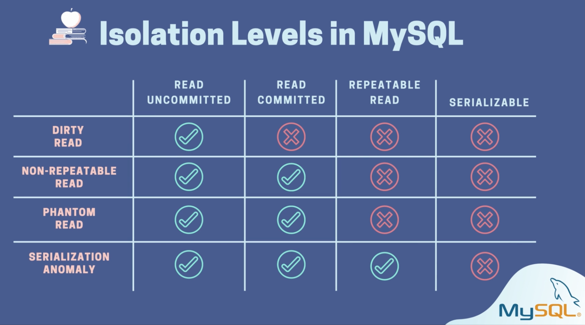
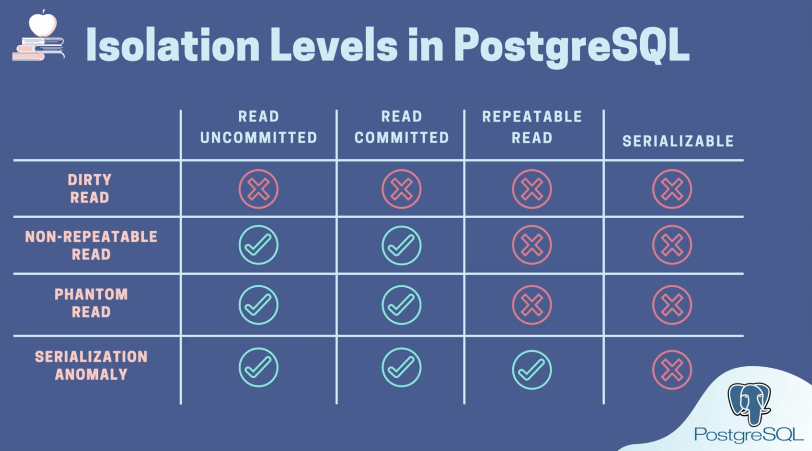

# Isolation in ACID

## Read Phenomena

### Dirty Read

- A Tx reads data written by other concurrent uncommitted Tx

### Non-repeatable Read

- A Tx reads the same row twice and sees different values because the row has been modified by other committed Tx

### Phantom Read

- Same as above for >1 rows

### Serialization Anomaly

- Result of a group of concurrent committed Txs is impossible to achieve if we try to run them sequentially in any order without overlapping
- Try
  1. selecting
  2. selecting sum
  3. and inserting the sum as a new row in a table
     concurrently in 2 txs at lvl. 3
  4. commit in tx#1 and in tx#2
  5. select in tx#2
  6. find 2 similar sum rows in the table

## Mitigation: Isolation levels: 1-4

- 1 - Dirty reads happen
- 2 - Dirty reads mitigated, only see data written by committed Tx
- 3 - Non-repeatable read, Phantom read mitigated, same query -> same result
- 4 - Serialization Anomaly mitigated

## Trying things out

### MySQL

#### Checking the isolation level of txs in the current session

- `select @@transaction_isolation`

#### Checking the global isolation level of txs

- `select @@global.transaction_isolation`

#### Setting the required tx isolation level in the current session

- `set transaction isolation level read uncommitted;`
- `set transaction isolation level read committed;`
- `set transaction isolation level repeatable read;`
  - at this isolation level, I modify a value in the 1st tx and commit it, read the same row in another, I don't see the change
  - then I update the same row in the 2nd tx, this update is based on the value committed by the 1st tx
- `set transaction isolation level serializable;`

### PostgreSQL

#### Checking the isolation level of txs

- `show transaction isolation level`

#### Setting the required tx isolation level in the `current tx`

- `set transaction isolation level read uncommitted;`
  - even on read uncommitted level, value modified on an uncommitted tx doesn't seep into the 2nd tx because it acts the same as read committed, basically no read uncommitted level
- `set transaction isolation level read committed;`
- `set transaction isolation level repeatable read;`
  - at this isolation level, I modify a value in the 1st tx and commit it, read the same row in another, I don't see the change
  - then I update the same row in the 2nd tx, it throws an error: could not serialize access due to concurrent update
- `set transaction isolation level serializable;`
  - the example in the corresponding section above would throw an error at this level

